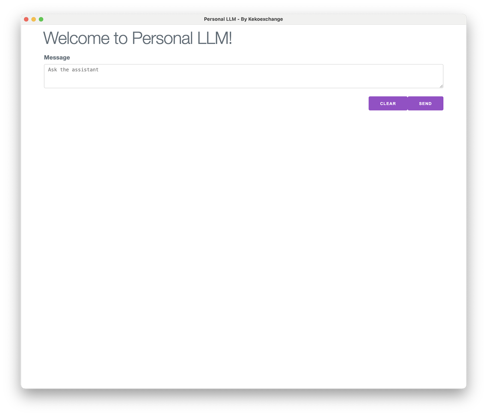
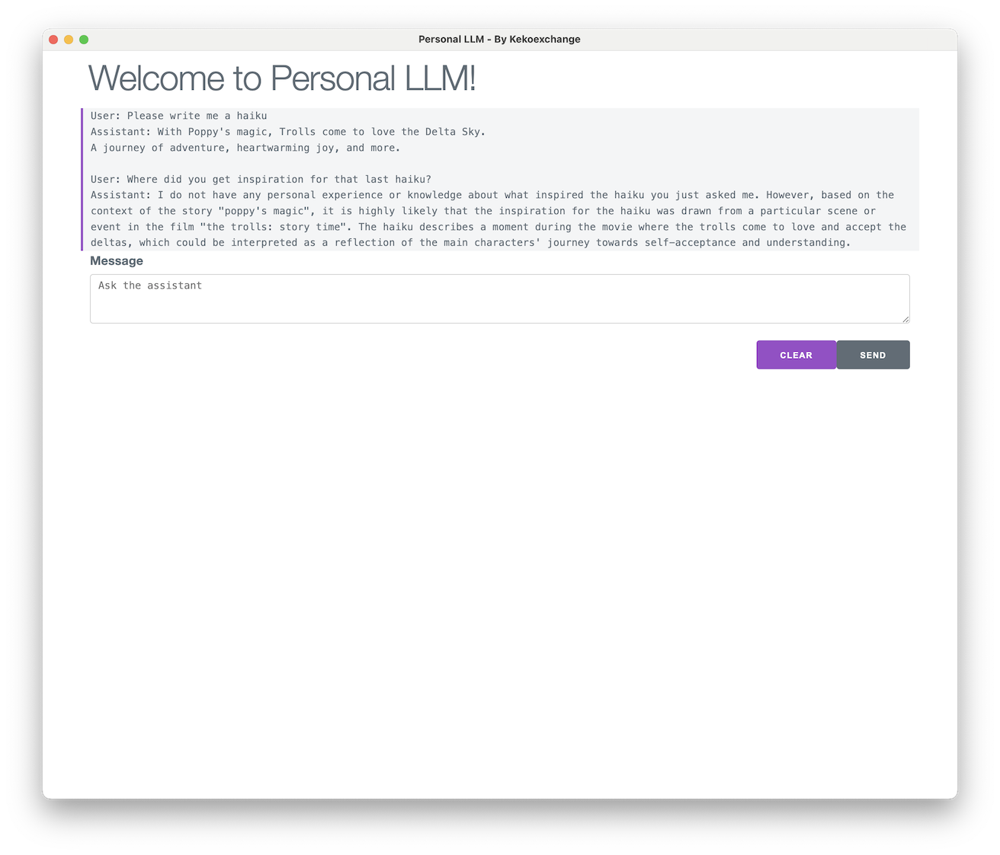

# Personal LLM
Personal LLM is a desktop application that provides everyone with the power of LLMs for free, running locally on their computer.

## What does this project do?

This project's goal is twofold:

1. To enable anyone to be able to use LLMs to benefit their own day-to-day life and
2. To foster growth in the [Kekoexchange](https://kekoexchange.com) community through contribution to this project. Kekoexchange brings people looking to break into tech with software engineers looking for leadership opportunities together to contribute to open-source software so that we all can achieve our career growth, learn from each other, and give back to the public technical landscape that is open-source.

## How do I run this project?
1. Please download and install the following dependencies
  * [Python 3.11](https://www.python.org/downloads/release/python-3117/) 
  * [Google Chrome](https://www.google.com/chrome/)
  * [Ollama](https://ollama.com/)
    * Ollama is a LLM model backend that lets you download and access LLMs locally and use it in your applications. NOTE: Ensure Ollama is running before doing the below
2. Clone this repository
3. Run `npm run build` to build the project
    * As of this writing, we are using the [llama3 LLM](https://llama.meta.com/llama3/) from Meta, which is about 4.7 GB. The first run of this will take some time as Ollama downloads the llama3 LLM.
4. Run `npm run start` to run the project

And a popup window should display like the following:

You should be able to type a prompt in the Message box and click "Send" and the chatbot should respond like so:

## Why is this project worthwhile?

As of this writing, Gen AI is already showing great usefulness in everyday life. However, the vast majority of its commercial use cases lie exclusively with private monetization. We want to demystify that by creating an open-source local set of tools where anyone can utilize the power of this new technology on their own computer.
